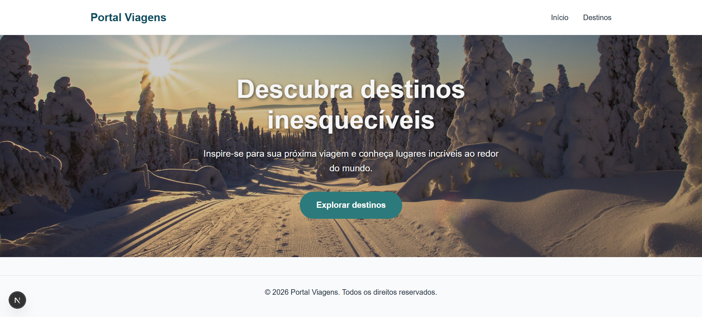
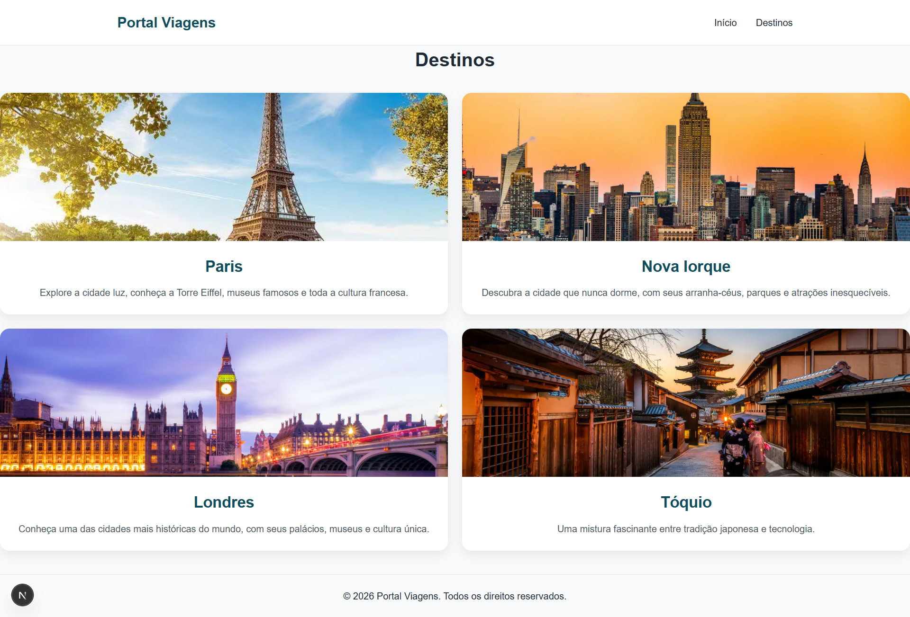
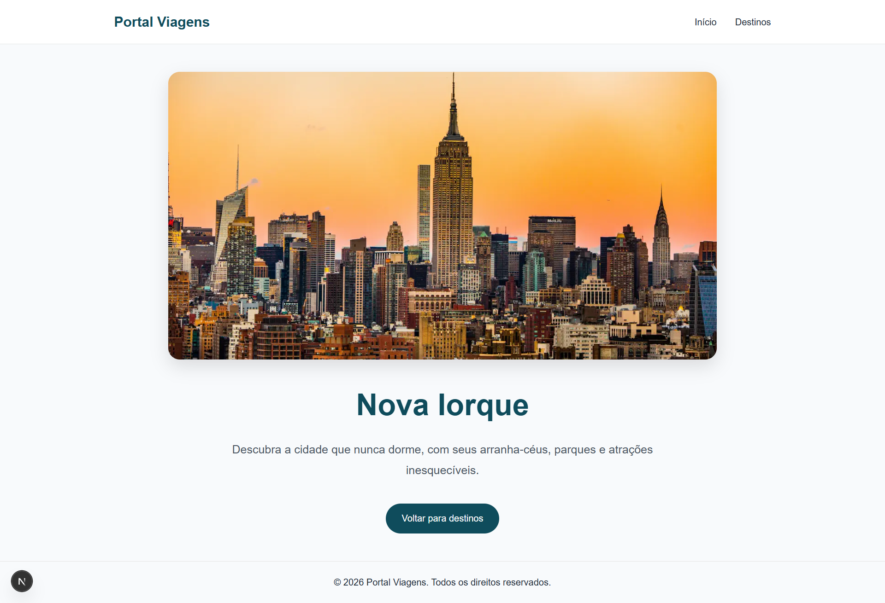

# 🌍✈️ Portal Viagens

Portal de viagens desenvolvido com **Next.js**, **React** e **TypeScript**, simulando uma plataforma de destinos turísticos. A aplicação utiliza rotas estáticas e dinâmicas, componentização, organização de dados, CSS Modules e otimização de imagens com recursos nativos do Next.js.


---

## 📸 Preview

| Página Inicial | Destinos | Detalhes |
|----------------|-----------|----------|
|  |  |  |
---

## ✨ Funcionalidades

- Página inicial com apresentação do portal.
- Hero Section com imagem de destaque e chamada para ação.
- Menu de navegação presente em todas as páginas utilizando `next/link`.
- Página de listagem de destinos turísticos.
- Exibição de **4 destinos**:
  - Paris
  - Nova Iorque
  - Londres
  - Tóquio
- Cards reutilizáveis para apresentação dos destinos.
- Página dinâmica de detalhes para cada destino (`/destinos/[id]`).
- Dados organizados em arquivo separado (`src/data/destinos.ts`).
- Layout reutilizável com Header e Footer.
- Interface moderna e responsiva.
- Otimização de imagens utilizando o componente `Image` do Next.js.

---

## 🛣️ Rotas da aplicação

| Rota | Descrição |
|------|-----------|
| `/` | Página inicial com Hero Section |
| `/destinos` | Lista de destinos disponíveis |
| `/destinos/[id]` | Página dinâmica com detalhes do destino |

---

## 🚀 Tecnologias

- Next.js 16
- React
- TypeScript
- CSS Modules

---

## 📂 Estrutura do Projeto

```text
portal-viagens
├── public
│     └── images
│          └── preview
│
├── src
│   ├── app
│   │   ├── globals.css
│   │   ├── layout.tsx
│   │   ├── page.tsx
│   │   └── destinos
│   │       ├── page.module.css
│   │       ├── page.tsx
│   │       └── [id]
│   │           ├── page.module.css
│   │           └── page.tsx
│   │
│   ├── components
│   │   ├── DestinationCard
│   │   │   ├── DestinationCard.tsx
│   │   │   └── DestinationCard.module.css
│   │   │
│   │   ├── Footer
│   │   │   ├── Footer.tsx
│   │   │   └── Footer.module.css
│   │   │
│   │   ├── Header
│   │   │   ├── Header.tsx
│   │   │   └── Header.module.css
│   │   │
│   │   └── Hero
│   │         ├── Hero.tsx
│   │         └── Hero.module.css
│   │
│   └── data
│       └── destinos.ts
│
├── package.json
├── tsconfig.json
├── next.config.ts
└── README.md
```

---

## 💻 Como executar o projeto

Clone o repositório:

```bash
git clone https://github.com/IsabelleLandini/portal-viagens-nextjs.git
```

Entre na pasta do projeto:

```bash
cd portal-viagens
```

Instale as dependências:

```bash
npm install
```

Execute a aplicação:

```bash
npm run dev
```

Acesse:

```text
http://localhost:3000
```

---

## 👩🏻‍💻 Desenvolvido por

**Isabelle Landini**
